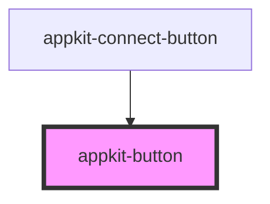

# appkit-button

<!-- Auto Generated Below -->

## Properties

| Property    | Attribute    | Description                                                            | Type                                                                          | Default          |
| ----------- | ------------ | ---------------------------------------------------------------------- | ----------------------------------------------------------------------------- | ---------------- |
| `ariaLabel` | `aria-label` | Explicit aria-label (overrides i18n auto-label)                        | `null \| string`                                                              | `null`           |
| `disabled`  | `disabled`   | Disable the button                                                     | `boolean`                                                                     | `false`          |
| `eventName` | `event-name` | Click event name to dispatch                                           | `string`                                                                      | `"appkit-click"` |
| `locale`    | `locale`     | Locale for i18n (aria-label fallback)                                  | `"en" \| "zh-TW"`                                                             | `"en"`           |
| `size`      | `size`       | Size preset (default, sm, lg, icon)                                    | `"default" \| "icon" \| "lg" \| "sm"`                                         | `"default"`      |
| `type`      | `type`       | Button type attribute                                                  | `"button" \| "reset" \| "submit"`                                             | `"button"`       |
| `variant`   | `variant`    | Visual variant (default, destructive, outline, secondary, ghost, link) | `"default" \| "destructive" \| "ghost" \| "link" \| "outline" \| "secondary"` | `"default"`      |

## Slots

| Slot        | Description                        |
| ----------- | ---------------------------------- |
| `"default"` | Button content (text, icons, etc.) |

## Dependencies

### Used by

 - [appkit-connect-button](../connect-button)

### Graph

----------------------------------------------

*Built with [StencilJS](https://stenciljs.com/)*
