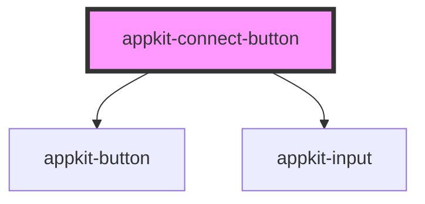

# appkit-connect-button

<!-- Auto Generated Below -->

## Properties

| Property            | Attribute             | Description | Type             | Default |
| ------------------- | --------------------- | ----------- | ---------------- | ------- |
| `address`           | `address`             |             | `string`         | `""`    |
| `balance`           | `balance`             |             | `null \| string` | `null`  |
| `balanceSymbol`     | `balance-symbol`      |             | `string`         | `"ETH"` |
| `connected`         | `connected`           |             | `boolean`        | `false` |
| `connecting`        | `connecting`          |             | `boolean`        | `false` |
| `explorerUrl`       | `explorer-url`        |             | `string`         | `""`    |
| `isBalanceLoading`  | `is-balance-loading`  |             | `boolean`        | `false` |
| `qrError`           | `qr-error`            |             | `null \| string` | `null`  |
| `qrLoading`         | `qr-loading`          |             | `boolean`        | `false` |
| `qrUri`             | `qr-uri`              |             | `null \| string` | `null`  |
| `tokenBalancesJson` | `token-balances-json` |             | `string`         | `"[]"`  |
| `walletsJson`       | `wallets-json`        |             | `string`         | `"[]"`  |

## Events

| Event                  | Description | Type                                                             |
| ---------------------- | ----------- | ---------------------------------------------------------------- |
| `appkitConnect`        |             | `CustomEvent<{ kind: string; walletId?: string \| undefined; }>` |
| `appkitCopyAddress`    |             | `CustomEvent<string>`                                            |
| `appkitDisconnect`     |             | `CustomEvent<void>`                                              |
| `appkitMobileDeepLink` |             | `CustomEvent<void>`                                              |
| `appkitRetry`          |             | `CustomEvent<void>`                                              |
| `appkitStartPairing`   |             | `CustomEvent<void>`                                              |

## Dependencies

### Depends on

- [appkit-button](../button)
- [appkit-input](../input)

### Graph

----------------------------------------------

*Built with [StencilJS](https://stenciljs.com/)*
