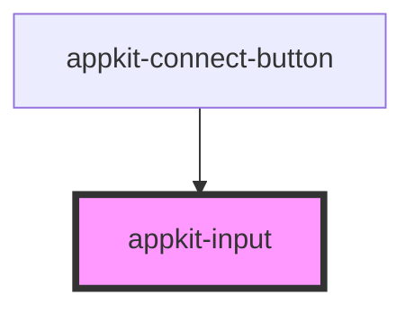

# appkit-input

<!-- Auto Generated Below -->

## Properties

| Property       | Attribute      | Description                | Type      | Default  |
| -------------- | -------------- | -------------------------- | --------- | -------- |
| `autocomplete` | `autocomplete` | Autocomplete hint          | `string`  | `"off"`  |
| `disabled`     | `disabled`     | Disable input              | `boolean` | `false`  |
| `invalid`      | `invalid`      | Invalid state              | `boolean` | `false`  |
| `name`         | `name`         | Name attribute (for forms) | `string`  | `""`     |
| `placeholder`  | `placeholder`  | Placeholder text           | `string`  | `""`     |
| `type`         | `type`         | Input type                 | `string`  | `"text"` |
| `value`        | `value`        | Current value              | `string`  | `""`     |

## Dependencies

### Used by

 - [appkit-connect-button](../connect-button)

### Graph

----------------------------------------------

*Built with [StencilJS](https://stenciljs.com/)*
